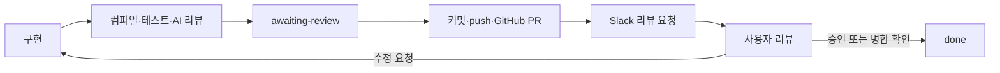

# workflow_view — 대화형 기획→구현 파이프라인

이 문서의 `.codex/`와 `.agents/` 경로는 저장소 루트 기준이다.

슬래시 커맨드 없이 채팅으로 구현 의도를 말해도 기획(PRD)→계획→구현→검증까지 자동으로 이어지게 한다. **새 로직을 최소화하고 기존 스킬/커맨드를 그대로 오케스트레이션**하는 것이 이 스킬의 유일한 존재 이유다 — 아래 각 단계는 대부분 기존 파일을 인용한다.

## 발동 조건

이 스킬은 Unity 게임 기능에 적용한다. Codex 설정 이전, 문서 정리, 일반 도구 설정에는 적용하지 않는다.

- 사용자가 구현 의도를 표현: "~해줘", "~만들어줘", "~추가해줘", "~생각중이야", "~하려고 하는데" 등
- 제외(발동 안 함): 버그 수정 요청("에러"/"버그"/"고장"/"크래시" 포함), `--skip-plan` 또는 "그냥 해줘"/"묻지 말고" 명시적 opt-out, 이미 이번 대화에서 요구사항이 확정된 후속 요청, "색만 바꿔줘"류 단순 수정
- 위 기준은 [deep-interview/SKILL.md](.agents/skills/deep-interview/SKILL.md)의 "When to Activate / Exemptions"와 동일한 기준을 공유한다 — 중복 정의하지 않고 그대로 따른다.

## 0단계: 기존 PRD 확인 (신규)

1. 요청 내용에서 기능명 후보를 PascalCase로 추출한다 (예: "조준선 예고 기능" → `AimTelegraph`).
2. `.codex/docs/prd/*.md`를 rg --files로 스캔한다.
3. 이름이 유사하거나 내용이 겹치는 기존 PRD가 있으면 읽어해서 제시한다: "기존에 `<FeatureName>` PRD가 있습니다 — 이어서 확장할까요, 새로 작성할까요?"
   - **확장**을 고르면 기존 PRD를 베이스로 2단계로 바로 진입(이미 채워진 섹션은 재질문하지 않음)
   - **새로 작성**을 고르면 1단계부터 진행
4. 일치하는 문서가 없으면 그냥 1단계로 진행한다.
5. 기존 PRD가 `awaiting-review`이면 [PR 리뷰 절차](references/pr-review.md)의 상태 파일과 기존 PR을 먼저 확인한다. 새 PRD/PR을 중복 생성하지 않는다.

## 1단계: 요구사항 게이트 (deep-interview 재사용)

[deep-interview/SKILL.md](.agents/skills/deep-interview/SKILL.md)의 모호성 채점 기준을 그대로 적용한다: Scope/Platform/Performance/Integration/Acceptance Criteria 5개 항목 0~2점, 합계 6/10 미만이면 가장 약한 항목 위주로 **라운드당 최대 3개 질문**.

동시에 AGENTS.md의 채팅 요청 규칙에 따라 다음 3가지를 1줄씩 조사해 다음 단계 PRD 재료로 쓴다:
1. 비슷한 기존 코드 검색 결과 (rg/rg --files)
2. Update/FixedUpdate 등 핫 루프 성능 영향
3. SO/이벤트로 확장 가능한 지점

조사는 여기서 멈추지 않는다. 2단계의 `classDiagram` 을 실제 이름으로 그릴 수 있을 만큼
**관련 클래스의 필드·메서드 시그니처와 서로의 참조 관계**를 확보하고, 그 과정에서 발견한
**이 코드베이스 고유의 함정**(공유 참조, 직렬화 상수, 브로드페이즈 제약 등)을 메모해둔다 — 2단계 함정 섹션의 재료다.
또 ①은 2-3 **재사용성**, ③은 2-3 **확장성** 근거로 그대로 인용되므로 "비슷한 코드 없음"도 결론으로 남긴다.

## 2단계: 설계도(Artifact) 작성 — **실행 순서 + 진짜 코드**

> 이 단계의 산출물은 "읽는 기능 명세"가 아니라 **보고 승인하는 코드**다.
> 사용자가 승인하는 대상은 기능 설명이 아니라 **"이 순서로 이 코드를 짜겠다"** 는 합의다.
> 기능 목록·산문·추상적 책임 설명을 나열하지 말 것.

### 2-1. 구성 기준은 **런타임 실행 순서**

섹션을 기능별·파일별로 나누지 않는다. **코드가 실제로 실행되는 시간 순서**로 번호를 매긴다.
각 스텝 제목에 **언제 도는지**를 박는다:

```
STEP 1  [누르는 순간]   InputManager 가 Subject 발행
STEP 2  [Start · 1회]   ChargeShooter 구독 + 버퍼 확보
STEP 3  [매 프레임]     Update 누산 · 오브 스케일
STEP 4  [떼는 순간]     배율 계산 → 발사
STEP 5  [같은 프레임]   Weapon 이 풀에서 Pop
STEP 6  [다음 프레임]   ColliderManager 가 반경 재조회
STEP 7  [풀 반납 시]    원복
STEP 8  [항상 병렬]     기존 자동사격은 계속 돈다
```

이렇게 잡으면 "어디서 시작해서 어디서 끝나는지"와 "어느 훅(Awake/Start/Update/OnDisable)에 무엇이 들어가는지"가
동시에 드러난다. Unity 는 생명주기 순서가 곧 버그의 원인이라 이 축이 가장 정확하다.

### 2-2. 각 스텝은 **실제로 작성할 코드**를 보여준다 (핵심)

- **의사코드·요약 금지.** `.cs` 파일에 그대로 들어갈 코드를 쓴다 — 주석 헤더(`/*//// 목적 : ... ////*/`),
  `m_` 필드 / `_` 매개변수 접두사, 타입 접두사(`f`/`i`/`v`/`ref`/`t`), `sealed`, 명시적 접근 제한자까지
  [.codex/rules/csharp-unity.md](.codex/rules/csharp-unity.md) 그대로.
- 코드 블록 위에는 **파일 경로 + `신규`/`수정` 배지**.
- **수정**이면 끼어드는 위치를 알 수 있게 **앞뒤 기존 코드 1~2줄**을 같이 보여준다(전체 파일을 다시 쓰지 않는다).
- 왜 그렇게 쓰는지는 **코드 주석으로** 넣는다. 코드 밖 설명 문단을 따로 만들지 않는다 — 예외는 2-3의 구조 근거 3줄뿐이다.
- 한 스텝의 코드가 40줄을 넘으면 스텝을 쪼갠다.
- 구현 단계(4단계)는 **이 코드를 옮기고 컴파일을 맞추는 일**이 된다. 그래서 여기서 대충 쓰면 안 된다 —
  여기 적힌 코드와 실제 커밋된 코드가 다르면 그건 설계도가 틀린 것이다.

### 2-3. 각 코드 블록 뒤 **구조 근거 3줄** (생략 불가)

STEP 코드 블록 바로 아래에 **다양성 / 재사용성 / 확장성** 세 줄을 붙인다.
2-2의 "코드 밖 설명 문단을 따로 만들지 않는다"의 **유일한 예외** — 라인 단위의 "왜 이렇게 썼나"는 코드 주석이지만,
이 세 줄은 **구조 선택의 근거**라 코드 주석에 들어갈 수 없다. 사용자가 승인하는 것은 코드이자 이 구조다.

"깔끔하다"류 추상적 칭찬 금지. **탈락시킨 대안과 비교해 숫자로** 쓴다("수정 0줄", "에셋 1개 추가", "분기 없음").

| 항목 | 써야 할 것 | 예시 |
|---|---|---|
| **다양성** | 이 구조로 코드 수정 없이 몇 종류의 변형이 나오는지 | "Action SO 교체만으로 돌진/원거리/자폭 3종 — `Monster.cs` 수정 0줄" |
| **재사용성** | 이미 있는 무엇을 재사용했고, 이 코드는 다음에 누가 그대로 쓰는지 | "`ObjectPoolManager` 를 그대로 씀(신규 풀 코드 0줄). 이 `DamageDealer` 는 함정·투사체에도 붙이기만 하면 됨" |
| **확장성** | 다음 요구가 왔을 때 무엇을 '추가'하면 되고 무엇을 '수정'하지 않아도 되는지(OCP) | "카드 등급 추가 = `SOCardData` 에셋 1개. `switch` 없음 → 기존 클래스 수정 0줄" |

- **재사용성**은 1단계 조사 ①(비슷한 기존 코드), **확장성**은 1단계 조사 ③(SO/이벤트 확장 지점)의 결과를 인용한다 — 새로 지어내지 않는다.
- 재사용할 기존 코드가 없으면 없다고 쓰고 **왜 신규인지**를 적는다(거짓 재사용 금지).
- **세 줄이 안 써지면 설계가 틀린 것이다** — 근거를 꾸미지 말고 STEP 코드를 고치고 다시 쓴다.
- 이 세 줄은 2-7의 저장용 PRD 와 Artifact 양쪽에 그대로 들어간다.

형식:

````markdown
**STEP 3 [매 프레임]** · `Assets/3D/01_Scripts/Card/CardInventory.cs` `신규`

```csharp
// ... 실제 코드 ...
```

- **다양성**: 조커/장비/패시브 카드가 전부 `SOCardData` 라 같은 인벤토리를 그대로 쓴다 — 타입 분기 0개.
- **재사용성**: `Player` 가 `BattleManager.Exp` 를 구독하는 기존 `ReactiveProperty` 패턴 그대로 — HUD·상점·툴팁이 `Subscribe(...).AddTo(this)` 한 줄로 붙는다.
- **확장성**: 보유 상한은 `[SerializeField]`, 카드 추가는 SO 에셋 추가 → 둘 다 클래스 수정 0줄. 획득 알림이 필요해지면 `Subject<SOCardData>` 하나만 덧붙이면 된다.
````

### 2-4. 다이어그램은 코드의 **보조**

| 종류 | 역할 | 필수 |
|---|---|---|
| `sequenceDiagram` | 위 STEP 번호를 그대로 단 호출 순서 | ✅ |
| `classDiagram` | 전체 구조 한 장 — 실제 필드·메서드 시그니처와 참조 관계 | ✅ |
| `stateDiagram-v2` | 상태가 있는 기능의 전이 | 상태 있을 때만 |
| `flowchart` | 흐름이 여러 갈래로 갈릴 때 | 선택 |

- **실제 이름만 쓴다.** 일반명사(`Manager`, `Handler`)로 얼버무리지 않는다.
- 신규/수정/기존 구분: `flowchart` 는 `classDef new fill:#D6F3EF,stroke:#0E8F84,color:#0A3A35` 처럼
  **fill·stroke·color 전부 명시**(라이트/다크 양쪽 가독성), `classDiagram` 은 색 대신 `<<신규>>`/`<<수정>>`/`<<기존>>` 스테레오타입.

**mermaid 파싱 사고 방지 (실제로 깨졌던 것들):**
- `classDiagram` 멤버 줄에 괄호 두 번 금지 — `-Start() 구독 AddTo(this)` ❌ → `-Start() 구독등록` ✅
- 멤버 줄에 대괄호 금지 — `-AttackInfo[] m_arr` ❌ → `-AttackInfo m_arr_링버퍼` ✅
- 제네릭은 `~T~` — `List~Weapon~ m_listWeapon`
- 라벨 안 `<` `>` 는 `미만`/`초과` 로 (HTML 엔티티로 디코드되어 파서를 깬다)
- HTML 태그는 `<br/>` 만 — `<b>` 는 글자로 찍힌다

### 2-5. 함정 섹션 (필수)

조사에서 발견한 **이 코드베이스라서 실제로 터질 문제** 2~3개와 각각의 대응을 넣는다.
(공유 참조, `[SerializeField]` 상수, 브로드페이즈/그리드 제약, 풀 재사용 시 상태 잔존 등)
기능 설명보다 이쪽이 구조 결정을 지배한다 — 함정이 없다면 조사가 부족한 것이다.

### 2-6. 설계 제시와 승인

1. 조사 → STEP 분해 → 각 STEP 코드를 담은 설계를 `.codex/docs/prd/<FeatureName>.md`에 `status: draft`로 저장한다. 실제 소스 파일은 승인 후 작성한다.
2. Markdown 파일 링크로 설계를 보여주고, 가능하면 Codex 파일 패널로 연다. 외부 Artifact 게시 도구는 필수 의존성이 아니다.
3. 설계에 대한 사용자 승인을 받는다. 현재 세션이 Plan 모드이면 그 모드의 제한을 따른다. 모드 전환 도구를 가정하거나 직접 호출하지 않는다.
4. 이미 같은 범위가 승인되었거나 사용자가 바로 구현하라고 명시한 경우 재승인을 요구하지 않는다.

### 2-7. 승인된 PRD 확정

PRD 골격은 [PRD 템플릿](https://gist.github.com/gkossakowski/21cd41fc3801de9d7d0201e0792c7ded) 구조를 따른다: Overview(Purpose/Scope/Tech Stack) → User Flow(Entry/Core Steps/Edge Cases) → Functional Requirements(UI/Core Features/Data&Integration/NFR) → Technical Architecture(**STEP별 코드 + 근거 3줄 + 다이어그램 mermaid 소스 그대로**) → Assumptions&Constraints → Implementation Plan(Milestones/Ownership/DoD) → Detailed Specs → Roadmap → External Resources → Changelog.

- **각 주요 요구사항 항목 뒤에는 반드시 Rationale(왜 이렇게 결정했는지) 한 줄을 붙인다.**
- **Acceptance Criteria 는 BDD 형식(Given-When-Then)**:
  ```
  Given [사전 상태]
  When [행위/트리거]
  Then [기대 결과]
  ```
  이 목록은 그대로 4단계(테스트 생성)의 어서션 계획으로 재사용한다 — [unity-workflow.md](.agents/skills/unity-workflow/SKILL.md) 3단계 참고.
- Technical Architecture 구성 기준은 Structurizr 의 C4 계층(System Context → Container → Component → Dynamic)을 빌려오되, 렌더링은 프로젝트 표준인 **Mermaid** ([.codex/rules/architecture.md](.codex/rules/architecture.md) "Mermaid 다이어그램 작성 규칙").
- 저장 위치: `.codex/docs/prd/<FeatureName>.md` — 맨 위 YAML 프런트매터 `status: approved` + `artifact: <설계 문서 경로>`, 그 아래 PRD 전문.
- 승인 전에는 `status: draft`를 유지하고, 승인받은 뒤에만 `approved`로 바꾼다. 사용자가 "예약해줘"라고 해도 미승인 초안을 무인 실행 큐에 넣지 않는다.
- **이 `status` 필드가 밤 무인 실행의 큐다**: `autopilot.ps1`은 `status: approved`인 PRD만 고른다. 별도 `$unity-autopilot` 절차는 기존 규칙을 따른다. 대화형 `workflow_view`는 승인 후 `in-progress` → 구현·검증 후 `awaiting-review` → 사용자 승인/병합 확인 후 `done`으로 진행한다.

마지막으로 묻는다: **"지금 구현할까요, 아니면 밤 autopilot 큐에 둘까요?"** — 큐에 두면 여기서 끝난다(3~6단계 생략).

## 3단계: 계획 (unity-workflow 재사용)

[unity-workflow.md](.agents/skills/unity-workflow/SKILL.md) 2단계 — 탐색 결과를 인용한 구현 계획 + Mermaid. PRD의 Technical Architecture가 이미 그 역할이면 중복 작성하지 않고 승인만 받는다.

## 4단계: 실행 (unity-workflow 재사용)

구현 전에 [PR 리뷰 절차](references/pr-review.md) 1단계로 GitHub 로그인·base/head·기존 변경과 이번 작업 범위를 확인한다.

[unity-workflow.md](.agents/skills/unity-workflow/SKILL.md) 3단계를 이 세션이 직접 수행한다. 통합 테스트는 2단계의 Given-When-Then을 어서션 계획으로 그대로 쓴다.

## 5단계: 검증 (unity-workflow 재사용)

[unity-workflow.md](.agents/skills/unity-workflow/SKILL.md) 4단계(컴파일 → 테스트 → `unity-reviewer` 독립 리뷰 → Deslop). 끝나면 PRD `status: awaiting-review` + `## Result` 섹션을 기록한다. 아직 최종 완료로 표시하지 않는다.

## 6단계: GitHub PR → Slack → 사용자 리뷰

[PR 리뷰 절차](references/pr-review.md) 2~5단계를 수행한다. `.codex/review-workflow.json`의 활성화 설정은 이 워크플로 작업의 명시적 파일 커밋·push·PR 생성/갱신과 지정된 Slack 대상 알림에 대한 사용자 사전 승인이다. 별도 merge 권한은 포함하지 않는다.

이번 작업의 변경만 커밋하고 리뷰 가능한 PR을 생성한다. 기존 PR이면 갱신한다. PR URL과 최신 head를 확인한 뒤 Slack으로 한 번 알린다. 수신 대상/연결이 없으면 PR 링크를 최종 답변에 제공하고 알림을 대기로 남긴다. 실제 성공 결과 없이 PR/Slack 전송 완료라고 말하지 않는다.



`enabled: false`이면 외부 게시와 자동 커밋을 생략하고 로컬 사용자 리뷰를 기다린다. PR/Slack 실패는 실패 단계와 복구 방법을 보고하며, 게임 코드 구현·검증 결과와 구분한다.

## 방법론 채택 노트

- **BDD(Given-When-Then)**: 채택 — 위 2/4단계에 반영.
- **MSA**: 미채택 — 단일 Unity 실행파일이라 서비스 분리가 성립하지 않음. `.codex/rules/architecture.md`의 "갓 오브젝트 금지"(System별 책임 분리)가 이미 같은 역할을 함.
- **OOP/FP**: 기본은 기존과 동일하게 OOP 유지(MonoBehaviour 컴포넌트 모델이 강제). 데미지 공식/커브 평가 등 순수 계산 로직에 한해 부작용 없는 함수로 작성하는 정도만 권장 — 전역 패러다임 전환 아님.
- **Agile**: 별도 스프린트/보드 없이 이 파이프라인의 0~6단계 자체가 짧은 반복 주기(계획→구현→검증→사용자 리뷰) 역할을 함.

## 설계 원칙

- 각 단계 게이트는 사용자 확인 필수 — 절대 건너뛰지 않는다.
- 기존 `unity-workflow`/`deep-interview`의 로직을 재사용하고 중복 구현하지 않는다. 이 스킬의 차별점은 오직: **자연어 자동 발동 + PRD/다이어그램의 문서화·재사용(0단계, 2단계 저장)**.
- 설계도의 축은 **런타임 실행 순서**이고, 각 스텝의 내용은 **실제로 작성할 코드**다. 둘 중 하나라도 빠지면 미완성이다.
- 사용자가 승인하는 것은 기능 설명이 아니라 코드다. 여기 적힌 코드와 실제 커밋이 다르면 설계도가 틀린 것이다.
- 코드 블록마다 **다양성·재사용성·확장성 근거 3줄**이 붙어 있어야 한다. 빠진 블록이 하나라도 있으면 승인을 요청하지 않는다.
- 산문·근거는 저장용 `.md` 와 계획 파일로, 화면은 순서·코드·다이어그램으로. 터미널에 긴 설명을 쏟지 않는다.
