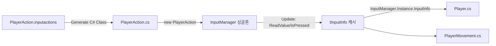
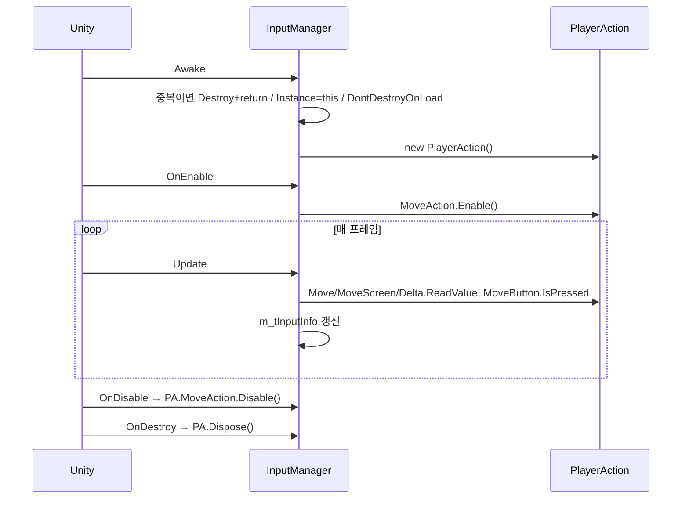

# InputManager 생성 C# 클래스 전환 PRD

## 1. Overview
- **Purpose**: `InputManager`가 액션마다 `List<InputActionReference>` 필드 + 인스펙터 드래그 + Update 메서드를 요구하는 구조를, `.inputactions`에서 자동 생성되는 `PlayerAction` 클래스를 소유하는 구조로 바꾼다. 액션 추가 비용을 "코드 한 줄"로 줄이고 인스펙터 미할당 런타임 null을 컴파일 타임 오류로 옮긴다.
  - *Rationale*: 액션 4개에 이미 필드 4·메서드 4·인스펙터 슬롯 4가 필요하고, 액션이 늘수록 선형으로 늘어난다. 생성 클래스는 이름 변경/삭제를 컴파일러가 잡는다. (`rules/architecture.md` "입력 시스템 아키텍처" 결정 2026-09-14)
- **Scope**: `Assets/3D/06_Input/InputManager.cs` 내부 교체, `m_Instance` → `Instance` 프로퍼티, 소비자 2파일의 참조 2줄씩, EditMode 테스트. **씬/프리팹 변경 없음.**
- **Out of scope**: `DontDestroyOnLoad`가 자식 오브젝트라 무시되는 문제(known-issues.md), `tInputInfo.OnLButon` 미사용 필드 정리, R3 Observable 노출, 액션 맵 전환(UI 맵 없음).
- **Tech**: Unity 2022.3 · Input System 패키지 · 생성 클래스 `Assets/3D/06_Input/PlayerAction.cs`(이미 생성됨, `generateWrapperCode: 1`).

## 2. User Flow (런타임 데이터 흐름)

- Entry: 부트 씬의 `InputManager` GameObject(기존 위치 그대로) `Awake`.
- Core: `OnEnable`에서 맵 `Enable()`, 매 `Update`에서 4개 값 읽어 `tInputInfo`에 캐싱, 소비자는 그대로 `InputInfo` 읽음.
- Edge: 중복 인스턴스 → `Destroy` + `return`. 마우스 `Delta` 첫 프레임 튐 방지 로직(`m_isDeltaInitialized`) 유지. `OnDisable`에서 `Disable()`, `OnDestroy`에서 `Dispose()`.

## 3. Functional Requirements
### Core
- FR-1 `InputManager`는 `PlayerAction` 인스턴스 하나를 `private` 필드로 소유한다. `[SerializeField] List<InputActionReference>` 4개는 삭제한다.
  - *Rationale*: 필드가 **삭제**되므로 `[FormerlySerializedAs]` 불필요(이름 변경이 아님). 씬에 남은 옛 직렬화 데이터는 Unity가 무시한다 → 씬 수정 불필요.
- FR-2 공개 API는 `InputManager.Instance`(프로퍼티, private set)와 `InputInfo`(`tInputInfo`) 둘뿐. `public static InputManager m_Instance` raw 필드는 제거.
  - *Rationale*: `rules/architecture.md` 싱글톤 규칙(raw public static 금지, Awake 가드 `return` 필수).
- FR-3 `Update`에서 읽는 값과 의미는 현재와 동일: `MoveDir = Move.ReadValue<Vector2>().normalized`, `ScreenPos = MoveScreen.ReadValue<Vector2>()`, `Delta = Delta.ReadValue<Vector2>()`(첫 프레임 가드 유지), `OnSpace = MoveButton.IsPressed()`.
  - *Rationale*: 소비자(`Player.cs`, `PlayerMovement.cs`) 동작을 바꾸지 않는 순수 내부 교체.
- FR-4 `OnEnable`: `m_refActions.MoveAction.Enable()`, `OnDisable`: `Disable()`, `OnDestroy`: `Dispose()`. `Awake`에서 `Enable()` 하지 않는다.
  - *Rationale*: `rules/unity-specifics.md` 입력 생명주기 — 짝을 맞춘 Enable/Disable.
- FR-5 소비자 `Player.cs`(151, 188행), `PlayerMovement.cs`(58, 59행)의 `InputManager.m_Instance` → `InputManager.Instance`. 그 외 변경 없음.
- FR-6 `tInputInfo` 구조체는 그대로 둔다(같은 파일, 필드 동일).
  - *Rationale*: 범위 최소화. "파일당 타입 하나" 규칙 위반은 기존 상태이며 이 PRD가 넓히지 않는다.

### NFR
- Update 내 힙 할당 0 (현재와 동일). 리스트 순회 4개 → 직접 프로퍼티 접근으로 감소.
- 컴파일 경고 신규 0. `using Unity.VisualScripting`, `using System.Collections` 등 미사용 using 제거.

## 4. Technical Architecture
- **Component**: `InputManager : MonoBehaviour` (sealed) — 필드: `m_refActions : PlayerAction`, `m_tInputInfo : tInputInfo`, `m_bDeltaInitialized : bool`. 프로퍼티: `Instance`, `InputInfo`.
- **Dynamic**:

- **Naming**: `m_refActions`, `m_tInputInfo`, `m_bDeltaInitialized`(기존 `m_isDeltaInitialized` — private 비직렬화라 FormerlySerializedAs 불필요), 지역 `vMoveValue` 등 `rules/csharp-unity.md`.

## 5. Assumptions & Constraints
- `PlayerAction.cs`는 이미 생성되어 있고 컴파일된다(2026-09-14 확인). 액션 맵 이름 `MoveAction`, 액션 `Move/MoveScreen/Delta/MoveButton`.
- 씬 3개(Battle/Test/Main)의 `InputManager` 컴포넌트는 그대로 둔다. 옛 리스트 필드 데이터는 무시된다.
- `DontDestroyOnLoad(gameObject)` 호출은 기존대로 유지(자식 문제는 별도 이슈).
- `InputManager`는 asmdef 없이 `Assembly-CSharp`에 있음 → 테스트는 `Assets/Tests/Editor/`(Assembly-CSharp-Editor)의 **EditMode**만 가능. PlayMode asmdef는 predefined 어셈블리를 참조할 수 없다.

## 6. Implementation Plan (autopilot 순서)
1. `InputManager.cs` 재작성 (FR-1~4, FR-6). 헤더 주석 블록은 목적을 갱신해 유지.
2. `Player.cs`, `PlayerMovement.cs`의 `m_Instance` → `Instance` (grep으로 다른 사용처 없음 재확인).
3. `refresh_unity(compile)` → `read_console` 에러 0.
4. `Assets/Tests/Editor/InputManagerTests.cs` 작성 (7절) → `run_tests(EditMode)` 통과. 기존 `BoxColliderGridTests`, `ColliderManagerTests`도 통과 유지.
5. `unity-reviewer` 독립 리뷰 → Critical 수정.
6. 커밋 `[Auto] InputManager 생성 C# 클래스 전환 — PRD: .claude/docs/prd/InputManagerGeneratedClass.md`.
- **DoD**: 컴파일 에러 0, EditMode 전체 통과, 리뷰 Critical 0, 씬 파일 diff 없음(`git diff --stat -- '*.unity' '*.prefab'` 비어 있음).

## 7. Acceptance Criteria (BDD → EditMode 테스트 어서션)
테스트는 `InputTestFixture` 없이 공개 API만 사용: `InputSystem.AddDevice<Keyboard>()` → `InputSystem.QueueStateEvent(kb, new KeyboardState(Key.X))` → `InputSystem.Update()`. TearDown에서 `InputSystem.RemoveDevice(kb)`, `PlayerAction.Dispose()`.

```
Given 생성 클래스 PlayerAction
When  new PlayerAction() 을 만들면
Then  MoveAction.Move / MoveScreen / Delta / MoveButton 이 null 이 아니고 각 action.name 이 "Move" / "MoveScreen" / "Delta" / "MoveButton" 이다

Given PlayerAction.MoveAction 이 Enable 된 상태와 가상 Keyboard
When  Space 를 누른 KeyboardState 를 큐에 넣고 InputSystem.Update()
Then  MoveAction.MoveButton.IsPressed() == true

Given 위와 같은 상태
When  W 를 누른 KeyboardState 를 큐에 넣고 InputSystem.Update()
Then  MoveAction.Move.ReadValue<Vector2>() == (0, 1)   (2D Vector composite up)

Given 아무 키도 안 누른 상태
When  InputSystem.Update()
Then  MoveButton.IsPressed() == false, Move.ReadValue<Vector2>() == Vector2.zero

Given 프로젝트 소스 전체
When  "InputManager.m_Instance" 를 grep
Then  0건 (Instance 프로퍼티로 전환 완료)
```
- *Rationale*: `InputManager`의 `Update`는 EditMode에서 자동 실행되지 않으므로, 실제 검증 대상인 "에셋→클래스 배선"과 "값 매핑"을 `PlayerAction` 레벨에서 확인하고, `InputManager` 쪽은 컴파일 + 독립 리뷰 + 아침 수동 스모크(플레이해서 WASD·Space·마우스)로 확인한다.

## 8. Detailed Specs — 목표 코드 골격
```csharp
using System;
using UnityEngine;
using UnityEngine.InputSystem;

/*///////////////////////////////////////////
                InputManager
목적 : 생성된 PlayerAction 클래스를 소유하고 매 프레임 입력 값을 읽어
       tInputInfo 로 캐싱해 노출하는 싱글톤. 입력에 대한 반응 로직은 갖지 않는다.
 *///////////////////////////////////////////

public struct tInputInfo { public Vector2 MoveDir; public Vector2 ScreenPos; public Vector2 Delta; public bool OnSpace; public bool OnLButon; }

public sealed class InputManager : MonoBehaviour
{
    public static InputManager Instance { get; private set; }

    private PlayerAction m_refActions;
    private tInputInfo m_tInputInfo;
    private bool m_bDeltaInitialized;

    public tInputInfo InputInfo => m_tInputInfo;

    private void Awake()
    {
        if (Instance != null && Instance != this) { Destroy(gameObject); return; }
        Instance = this;
        DontDestroyOnLoad(gameObject);
        m_refActions = new PlayerAction();
    }

    private void OnEnable()  => m_refActions.MoveAction.Enable();
    private void OnDisable() => m_refActions.MoveAction.Disable();
    private void OnDestroy() { if (m_refActions != null) m_refActions.Dispose(); }

    private void Update()
    {
        m_tInputInfo.MoveDir   = m_refActions.MoveAction.Move.ReadValue<Vector2>().normalized;
        m_tInputInfo.ScreenPos = m_refActions.MoveAction.MoveScreen.ReadValue<Vector2>();
        m_tInputInfo.OnSpace   = m_refActions.MoveAction.MoveButton.IsPressed();

        Vector2 vDelta = m_refActions.MoveAction.Delta.ReadValue<Vector2>();
        if (!m_bDeltaInitialized) { if (vDelta.sqrMagnitude > 0f) { m_bDeltaInitialized = true; vDelta = Vector2.zero; } }
        m_tInputInfo.Delta = vDelta;
    }
}
```
(`Delta` 첫 프레임 가드는 기존 의미 — 첫 유효 델타 한 번을 0으로 — 를 그대로 옮긴 것. 동작이 다르면 기존 코드 의미를 우선.)

## 9. Roadmap (이 PRD 밖)
- R3 도입 후 `MoveButton.performed` → `Subject<Unit>` 노출 (`r3` 스킬 "입력 스트림").
- `tInputInfo`를 별도 파일로 분리, `OnLButon` 정리.
- 부트 씬 매니저 루트화(`DontDestroyOnLoad` 이슈).

## 10. External Resources
- Input System "Generate C# Class": https://docs.unity3d.com/Packages/com.unity.inputsystem@1.7/manual/ActionAssets.html#auto-generating-script-code-for-actions
- 테스트용 이벤트 큐: `InputSystem.QueueStateEvent` / `KeyboardState`

## 11. Changelog
- 2026-09-14 작성. 사전 조건(생성 클래스 활성화)은 MCP로 이미 적용됨. `status: approved` — 밤 autopilot 큐.
