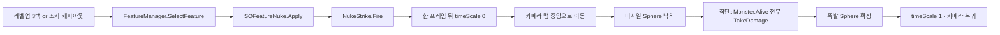
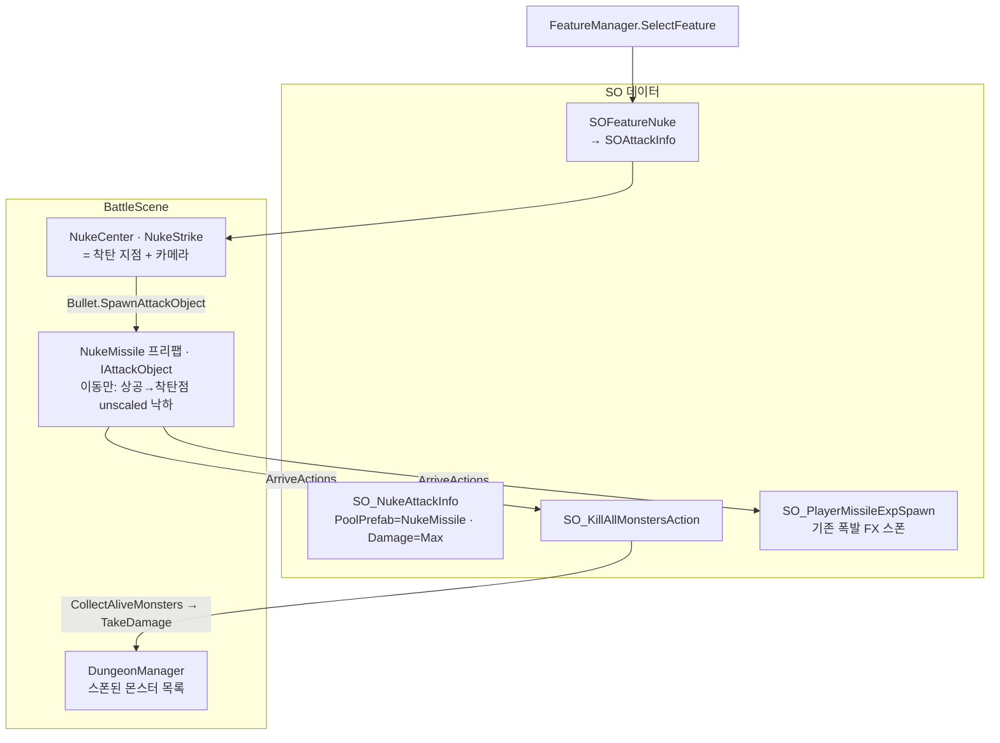
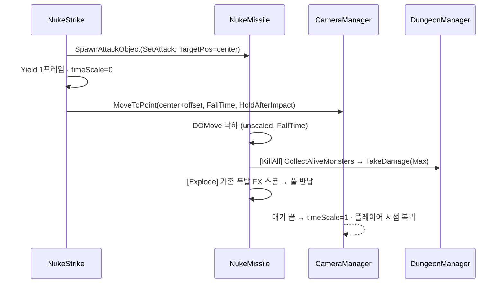

# 핵폭탄(Nuke) 레전더리 카드 PRD

> Artifact: https://claude.ai/code/artifact/1269f1bc-ec90-4d87-bd9f-9f4edb78e41c

## 1. Overview
- **Purpose**: 레벨업 3택/조커 캐시아웃으로 카드가 확정되는 순간 즉시 발동해, 맵의 모든 몬스터(보스 포함)를 최대 데미지로 제거하는 판도 뒤집기 카드. 기획서 v2 §05 "Legendary — 핵폭탄".
- **Scope**: 발동 트리거, 전체 몬스터 처치, 미사일 낙하→중앙 폭발 연출(Sphere 프리미티브 2개), 카메라 컷신. 확률/등급은 기존 데이터에 값만 채움.
- **Tech**: Unity 2022.3 URP · UniTask · DOTween · 기존 SOFeature/FeatureManager/CameraManager.
- **사용자 결정**: 폭발 위치 = 씬 앵커 Transform / 등급 색상 유지(Legendary 빨강) / 캐시아웃 경로도 즉시 발동 + Repeatable / 에셋 없이 Sphere 프리미티브.

## 2. User Flow

**Edge Cases**: 조커 실패로 Cancel 대상 → no-op / 연출 중 씬 전환 → CancellationToken 취소 / 몬스터 0마리 → 연출만.

## 3. Functional Requirements
| 항목 | 요구사항 |
|---|---|
| 발동 | `SOFeature.Apply` 즉시. 3택·캐시아웃 모두 `FeatureManager.SelectFeature` 경유라 동일 |
| 범위/데미지 | 활성 `Monster` 전부. 데미지 `int.MaxValue`(SO 필드 기본값) |
| 등급/확률 | 에셋 값 `Tier=Legendary, Weight=1, Repeatable, MaxLevel=0`. 확률은 `SOJokerCard_0.m_arrTierWeight[Legendary]` 곡선(조커 Lv0~3 = 0, Lv4 = 0.01, Lv5 = 0.0256) |
| 연출 | 런타임 `CreatePrimitive(Sphere)` 2개. 미사일 낙하(InQuad) → 폭발 scale 확장(OutCubic). 카메라 `CameraManager.MoveToPoint` |
| 테두리 색 | 변경 없음 |

**Rationale**: 기획서 v2 §9는 수치를 "플레이하며 조절"로 미뤄두었고 조커 SO 곡선이 이미 그 노브다. 코드에 확률 상수를 두지 않는다.

## 4. Technical Architecture

**Rationale · IAttackObject 직접 구현(Bullet 미상속)**: Bullet 이동은 BulletMoveManager Job(Time.deltaTime)이라 컷신 중 timeScale=0에서 멈추고, 충돌 판정도 불필요해 CircleCollider를 그리드에 넣을 이유가 없음(AttackObject와 같은 선례). 착탄 동작은 기존 SOBulletAction 조합.
**Rationale · 몬스터 목록은 DungeonManager**: Monster 클래스가 자기 개체수를 알 필요 없음. 스폰 담당(ObjectSpawner.OnSpawned → DungeonManager)이 들고, 죽은 개체는 CollectAliveMonsters에서 activeInHierarchy로 걸러 지연 제거. ObjectPoolManager의 활성 목록은 ActiveCap>0 풀에만 존재해 재사용 불가.
**Rationale · 한 프레임 뒤 timeScale 0**: `CardCreator.HandleCardClicked`/`JokerCardManager.PickData`가 `SelectFeature` 직후 `timeScale=1`로 되돌리므로 `UniTask.Yield` 후 정지. 복귀는 `MoveToPoint`의 기존 동작(보스 등장과 동일).

| 파일 | 변경 |
|---|---|
| `SOFeature.cs` | `eFeatureID.Nuke` 추가 |
| `SOFeatureNuke.cs` (신규) | `m_SOAttackInfo`. `Apply → NukeStrike.Current.Fire(SOAttackInfo)` |
| `NukeStrike.cs` (신규) | 씬 앵커 + 카메라. `Bullet.SpawnAttackObject`로 미사일 발사 |
| `NukeMissile.cs` (신규) | `IAttackObject`. FallHeight/FallTime + `SOBulletAction[] ArriveActions`. 낙하만 담당 |
| `SOKillAllMonstersAction.cs` (신규) | `SOBulletAction`. DungeonManager 목록 순회 TakeDamage |
| `ObjectSpawner.cs` | `event Action<GameObject> OnSpawned` |
| `DungeonManager.cs` | `m_listSpawnedMonster` + `CollectAliveMonsters` |

**에셋**: `NukeMissile.prefab`(Sphere + PoolObject AliveTime 0, Addressable) · `SO_NukeMissile Data`(PreLoad 1, `SO_BattleSceneData.PoolDataList` 등록) · `SO_NukeAttackInfo` · `SO_KillAllMonstersAction` · `SO_FeatureNuke` · 씬 `NukeCenter`(0,0,938.2).

**렌더링 전략**: Sphere 1개 + 기존 LargeHit FX. 핫 루프 영향 없음.

**카메라 연출**: 낙하 전반(`FollowRatio`)은 `CameraManager.FollowTarget`으로 미사일을 `FollowOffset`에서 추적 → 남은 낙하 시간 동안 `MoveToPoint`로 착탄점+`OverviewOffset`(맵 전경)까지 후진, 착탄과 동시에 도착 → `HoldAfterImpact` 대기 → 복귀. 카메라 far clip 620→1200(전경에서 맵 반대편이 잘리지 않게).
**임팩트**: `NukeImpact.prefab`(노란 구체, scale 300, `BulletMaterial_Y`, AliveTime 0.5 = 게임 재개 0.5초 뒤 반납) — `SO_NukeImpactSpawn`(SOSpawnExplosionAction)으로 착탄 액션에 조합.
**보스 등장 지연**: 몬스터 전멸 시 `DungeonManager.SpawnBossWhenCameraFree`가 `CameraManager.IsLocked`가 풀릴 때까지 기다린 뒤 보스 컷신 시작 — 핵 컷신과 카메라 겹침 해소.

## 5. Assumptions & Constraints
- UnityMCP 미연결 → 씬 배치/SO 에셋/FeatureManager 등록은 수동.
- `UNITASK_DOTWEEN_SUPPORT` 미정의 → `UniTask.Delay(ignoreTimeScale:true)`로 대기.
- `Monster.CurrentHP`가 `long`이라 `int.MaxValue` 감산 안전.

## 6. Developer Setup
1. `Assets/3D/02_Player/Feature/Node/` → Create → Game/Feature/SOFeatureNuke → `SO_FeatureNuke`. ID=Nuke, Tier=Legendary, Repeatable, Weight=1, MaxLevel=0, 아이콘/설명.
2. 씬 `FeatManager.m_listFeatureSO`에 드래그.
3. BattleScene에 빈 오브젝트 `NukeCenter`(맵 중앙, 대략 x -10 / y 90 / z 880) → `NukeStrike` 추가. FallHeight/ExplodeRadius 조정.
4. 즉시 테스트: `FeatManager.m_listPreLoadFeautre`에 잠깐 넣기.

## 7. Acceptance Criteria (BDD)
- Given 몬스터 N마리 활성 / When 3택에서 Nuke 클릭 / Then 한 프레임 뒤 정지 → 카메라 이동 → 구체 낙하 → 착탄 시 `Monster.Alive.Count == 0`, `OnMonsterDied` N회 → 폭발 확장 → timeScale 1, 카메라 복귀
- Given 조커 보류에 Nuke / When 캐시아웃 / Then 동일 시퀀스
- Given 조커 실패로 Cancel 대상 / Then 예외 없이 no-op
- Given 조커 Lv0~3 / Then 후보에 Nuke 미등장
- Given 씬에 NukeCenter 없음 / When 확정 / Then NRE 없이 로그 1줄

## 8. Changelog
- 2026-09-14 초안 승인.
- 2026-09-14 카메라 연출(추적→후진 전경) + 노란 구체 임팩트 + 사용자 제작 미사일 메쉬로 프리팹 교체 + 보스 등장 지연. 실플레이 검증.
- 2026-09-14 구조 변경: Monster 정적 목록 → DungeonManager 목록, 미사일을 IAttackObject 풀 프리팹으로 분리하고 착탄은 SOBulletAction 조합. 로비→스테이지 실플레이로 검증 완료.
