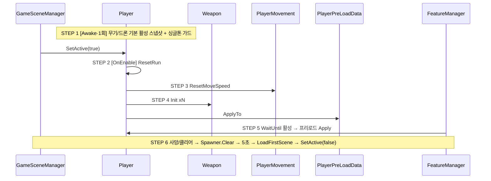

# PlayerRunReset — DDOL Player 런 리셋

## Overview

- **Purpose**: `Player`가 로비 씬 소속 `DontDestroyOnLoad`가 되면서 카드로 얻은 무기 활성·스탯 보너스·총알 액션이 런을 넘어 누적된다. 사망/클리어 후 재도전 시 플레이어를 처음 상태로 되돌린다.
- **Scope**: Player 런타임 상태(HP/상태이상/Attack/Defense/Speed 보너스/이속 보너스/무기 AttackInfo/명중·도착 액션/무기·드론 활성). 영구 성장(`PlayerPreLoadData`: 로비 강화·장비)은 유지·재적용. EXP/레벨·카드 레벨·조커 레벨은 매니저가 씬 소속이라 코드 0줄.
- **Tech**: Unity 2022.3 · R3 · UniTask. 신규 파일 0, 수정 6 (Player, PlayerMovement, Weapon, FeatureManager + 검증 중 발견한 DungeonManager, ObjectSpawner).

## User Flow

- **Entry**: 로비에서 스테이지 선택 → `GameSceneManager.LoadSceneAsync` → 씬·풀 로드 → `DungeonManager.StartStage` → `Player.SetActive(true)`.
- **Core**: `Player.OnEnable → ResetRun()` — SO 기본값 재조립 → `Weapon.Init`×N + 씬 배치 활성 복원 → `PlayerPreLoadData.ApplyTo` → State=Idle, CurrentHP=MaxHP, Movement on.
- **Exit**: 사망(`OnPlayerDied`)/보스 처치 → `DungeonManager.ClearStage` → 스포너 예약 Clear → 5초 → `LoadFirstScene` → `Player.SetActive(false)`.
- **Edge**: 풀 로딩 2초 초과 시 프리로드 카드가 ResetRun에 지워지는 레이스 → `FeatureManager.TestCode`가 시간 대신 Player 활성을 기다림. 로비 재로드 시 씬의 MainPlayer 중복 → `Player.Awake` 싱글톤 가드.

## 결정과 Rationale

| 결정 | Rationale |
|---|---|
| SO 기본값에서 재조립 (카드 `Cancel` 역순 ✗) | `AddAttack/AddSpeed`가 SO Max로 클램프해 `Apply(+X)→Cancel(-X)`가 0으로 안 돌아옴. `AddMaxHP`는 클램프 없음. 예전 "씬 재생성"과 의미 동일. |
| 훅 = `Player.OnEnable` (새 API ✗) | 활성화 지점이 `GameSceneManager` 하나뿐. 진입 경로가 늘어도 같은 훅. |
| 영구 성장 = `PlayerPreLoadData`만 | 로비 UI가 `GetPendingTotal`로 읽는 그 리스트. 런마다 기본값 위에 전체 재적용 → 중복 누적 없음. |
| 무기/드론 기본 활성 = Awake 스냅샷 | 로비 씬 배치 상태가 곧 기본 로드아웃. 인스펙터 중복 없음. |
| `Weapon.Init()` 재호출 | `MakeAttackInfo()`가 이미 SO→런타임 복사. 배율/액션/발사주기 4줄 추가. |
| PlayerMovement는 보너스 필드 | 같은 오브젝트 Awake/OnEnable 쌍 순서 때문에 스냅샷은 0이 될 수 있음. |
| `FeatureManager.TestCode` 활성 대기 | 2초 상수 vs 풀 로딩 레이스 제거. |

## Technical Architecture

설계도(STEP별 코드 + 근거 3줄): https://claude.ai/artifact/WrW2L3nj5QqZeN1WxvLciP



## Acceptance Criteria (BDD) — 결과

```
AC1  Given 런 중 ShotGun 해금 + Attack +50 + Speed +1 + MaxHP +100 후 사망 → 로비
     When  스테이지 0 재입장
     Then  ShotGun off, BaseWeapon_0/1만 on, Attack==0, 이속 보너스==0, Base0.Damage 18→12, MaxHP 1100→1000   ✅ (에디터 실측)
AC2  Given 첫 런 시작  When Player 활성화  Then CurrentHP==MaxHP==1000                                          ✅
AC3  Given 사망 후 재입장  When Player 활성화  Then State==Idle, Movement.enabled==true, Player 인스턴스 1개        ✅ (가드 전엔 런마다 +1)
AC4  Given 풀 로딩 2초 초과  Then 프리로드 카드 유지                                                             ⏸ 프리로드 리스트가 비어 있어 미실측 (코드 경로만 확인)
AC5  Given 명중 액션 카드 후 재입장  Then Weapon 액션 리스트 비어 있음                                              ✅ Init에서 Clear (코드)
AC6  Weapon.Init 호출부 = Player.ResetRun, Drone.Awake, Monster.Awake 뿐                                          ✅ grep
```

## Result (2026-09-17)

- 컴파일 에러 0, 에디터 루프(로비→스테이지0→카드 효과→사망→로비→재입장) 1회 실측: 재입장 시 전부 기본값, 몬스터 정상 스폰, 콘솔 에러 0.
- **검증 중 발견해 같이 고친 것 2건**
  1. `Player.Awake` 싱글톤 가드 없음 — 로비가 `LoadSceneMode.Single`로 재로드될 때마다 씬의 MainPlayer가 또 Awake → `CurrentPlayer` 덮어씀 → DDOL 원본은 죽은 채 방치, 런마다 Player +1. 가드 + `SetActive(false)` 후 Destroy (자식 `Weapon.Start`가 Init 안 된 상태로 돌면 빌드에선 `Application.Quit`).
  2. `ObjectSpawner`(DDOL) 예약이 런 종료 후 남아 씬 전환 뒤 파괴된 풀을 건드림 → MissingReference로 스폰 루프 사망 → 다음 런 몬스터 0. `Spawner.Clear()`를 `ClearStage`/`StartStage`에서 호출.

## 후속 (Out of scope)

- FeatureManager/BattleManager/JokerCardManager 명시적 `ResetRun` — 매니저 DDOL(known-issues) 고칠 때 짝으로.
- 해금 무기 영구화 등 메타 진행 확장 — `PlayerPreLoadData`에 `eStatType` 추가.
- 보스 사망 후 5초 내 플레이어 사망 시 `LoadFirstScene` 2회 — 재현되면 플래그 1개.
- BattleScene의 `DynamicObject/MainPlayer` 잔재(비활성) 삭제.
