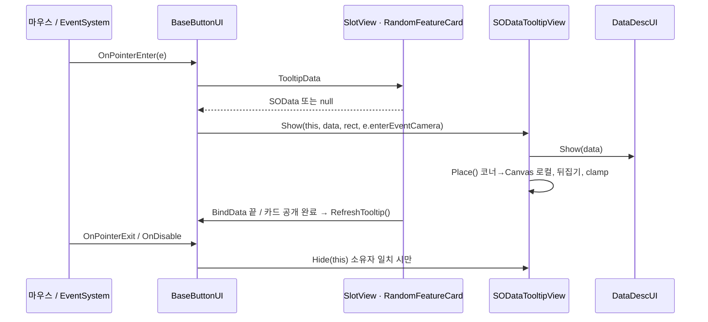
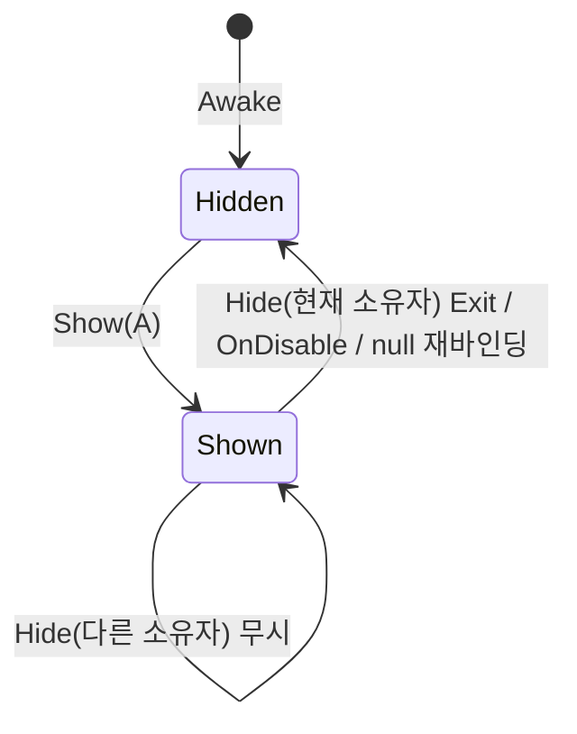

# SODataHoverTooltip — SlotView · 랜덤 카드 · Joker 후보 슬롯 공용 설명창

2026-09-22 승인·구현. 이전 `.codex/docs/prd/SODataHoverTooltip.md`(2026-09-20)는 autopilot 이 읽지 않는 경로라 미실행 — 이 문서로 대체.

## 1. Overview

- **Purpose:** 마우스가 `SOData` 를 든 UI 위에 올라가면 아이콘 + `Description` 을 그 옆에 띄운다.
- **Scope:** `Container` 가 만드는 모든 `SlotView`(Battle FeatContainer, Joker Select/Pick, 로비 Inven/Stat/Shop, `Interface` 장비 슬롯) · 레벨업 `RandomFeatureCard` · `JokerFeatureCard`(상속).
- **Tech:** UGUI EventSystem(`IPointerEnter/ExitHandler`), `CanvasGroup`, `RectTransformUtility`. Update 없음, hover 당 힙 할당 0.
- **결정:** hover 감지 = `BaseButtonUI` 훅 / 위치 = 슬롯 오른쪽 고정(가장자리면 왼쪽) / 내용 = 기존 `DataDescUI` 재사용 / EditMode 테스트 없음(사용자 결정).

## 2. User Flow

1. 데이터 있는 슬롯 또는 공개가 끝난 카드에 마우스 진입 → 오른쪽 8px 에 창.
2. 오른쪽이 모자라면 왼쪽으로 뒤집고, 위아래는 Canvas 안으로 clamp.
3. 이탈 / UI SetActive(false) / 빈 데이터로 재바인딩 → 닫힘.
4. 빈 슬롯, 회전 중인 카드 → 열리지 않음.

## 3. Functional Requirements

| # | 요구 | Rationale |
|---|---|---|
| F1 | 설명창 인스턴스 없음(2D 씬) 또는 `SOData == null` 이면 예외 없이 무시 | `m_Instance == null` 가드 하나로 씬별 분기 0 |
| F2 | 한 번에 창 하나, 새 대상 진입 시 즉시 교체 | Unity 는 Exit(A)→Enter(B) 순서라 `m_refOwner` 교체만으로 충분 |
| F3 | 소유자가 아닌 UI 의 Hide 는 무시 | 다른 오브젝트의 OnDisable 이 현재 창을 닫지 못하게 |
| F4 | 창은 raycast 를 막지 않음 | clamp 로 커서 밑에 깔리면 Enter/Exit 무한 깜빡임 |
| F5 | Update/FixedUpdate/LateUpdate 사용 금지, 코너 버퍼 재사용 | performance.md 황금 규칙 |
| F6 | `SlotView.BindData` 가 hover 중인 슬롯의 데이터를 바꾸면 갱신/닫기 | 드래그 스크롤·정렬·Joker Pick 삭제는 슬롯 오브젝트를 재사용 |
| F7 | 카드는 공개 완료 후에만 표시 | 회전 중 루트 Image 가 raycast 를 받으면 뒷면인데 Enter 가 옴 |
| F8 | SetActive(false) 로 사라지는 UI 는 `OnDisable` 에서 닫음 | `ExecuteEvents` 는 비활성 오브젝트에 PointerExit 를 보내지 않음 |
| NFR | 마우스 우선. Android 길게 누르기는 범위 밖 | 주 타겟 Windows |

## 4. Technical Architecture

코드·STEP·근거 3줄은 artifact 에 있다. 요약:

- `SODataTooltipView` (신규, sealed) — private static `m_Instance`, static `Show(owner, data, sourceRect, sourceCam)` / `Hide(owner)`, `Place()` 가 월드 코너→화면→설명창 Canvas 로컬 변환 후 오른쪽/왼쪽/clamp. `[RequireComponent(CanvasGroup, DataDescUI)]`.
- `BaseButtonUI` (수정) — `protected virtual SOData TooltipData => null`, `m_bPointerInside`, `m_refEventCamera = e.enterEventCamera`, Enter 끝 `RefreshTooltip()`, Exit·`OnDisable` 끝 `Hide(this)`, `protected RefreshTooltip()`.
- `SlotView` (수정) — `TooltipData => m_SOTargetSO`, `BindData` 끝 `RefreshTooltip()`.
- `RandomFeatureCard` (수정) — `m_bRevealed`, `TooltipData => m_bRevealed ? m_SOData : null`, `Setup` 에서 false+Refresh, `RotateAsync` 끝 true+Refresh.





## 5. Assumptions & Constraints

- BattleScene 의 CardCreator · FeatWindow · JokerContainers 와 LobyScene 의 컨테이너 4개가 각각 `PopupCanvas` / `PopUpCanvas`(둘 다 Overlay) 아래 → 씬당 프리팹 1개, 팝업 캔버스 마지막 자식.
- `BaseButtonUI` 파생 5개(Container, Interface, SlotView, RandomFeatureCard, JokerFeatureCard) 중 `OnDisable` 을 가진 것 없음 → `protected virtual OnDisable` 추가가 안전. 이후 파생이 쓰면 `base.OnDisable()` 필수.
- 씬/프리팹은 YAML 직접 편집 금지 — UnityMCP 또는 에디터.

## 6. Implementation Plan

| 마일스톤 | 내용 | DoD |
|---|---|---|
| M1 코드 | `.cs` 4개 (완료 2026-09-22) | 컴파일 에러 0 |
| M2 Unity 배선 | `Assets/3D/11_UI/Item/SODataTooltip.prefab` 생성, BattleScene `PopupCanvas` · LobyScene `PopUpCanvas` 마지막 자식으로 배치 | 두 씬에서 hover 시 창 표시 |
| M3 검증 | 아래 Acceptance 전부 + `unity-reviewer` | `status: done` |

## 7. Acceptance Criteria (BDD)

```
Given FeatWindow 열림, 데이터 든 SlotView   When 마우스 진입              Then 슬롯 오른쪽 8px 에 아이콘 + Description
Given 빈 SlotView                           When 마우스 진입              Then 창 없음
Given 레벨업 카드 회전 중                    When 마우스 진입              Then 안 뜸 → 회전 끝나면 뜸
Given Joker 후보 슬롯 위에 창                When 클릭해 Pick 으로 이동    Then 재정렬된 데이터로 갱신 또는 닫힘, 잔상 없음
Given 창 떠 있음                             When CardCreator.Close()/PickData()  Then 창 닫힘
Given 화면 오른쪽 끝 슬롯                    When 마우스 진입              Then 왼쪽으로 뒤집혀 캔버스 안
Given Container 드래그 스크롤 중             When 행이 바뀜                Then 커서 아래 슬롯의 새 데이터로 갱신
```

## 8. Prefab Spec (M2)

```
SODataTooltip   RectTransform(pivot 0,1 · width 320) · Image(Sci-Fi 배경, raycastTarget OFF)
                CanvasGroup · DataDescUI · SODataTooltipView
                VerticalLayoutGroup(padding 12, spacing 8) · ContentSizeFitter(Vertical = Preferred)
├─ Icon         Image · raycastTarget OFF · LayoutElement(preferredWidth 64, preferredHeight 64)
└─ Desc         TextMeshProUGUI · raycastTarget OFF · Wrapping On
DataDescUI      m_refImage → Icon · m_refDescTex → Desc · m_refOriginSprite 비움
```

## 9. Out of Scope

Android 길게 누르기 · 커서 추적 · 페이드 연출 · SO 이름/희귀도 필드 · BattleScene_2/MainScene/2D 씬 배치 · `guard-editor-runtime.sh` 백슬래시 경로 수정(별도).

## Changelog

- 2026-09-22 — 승인, M1 코드 완료. M2 는 UnityMCP 미연결로 사용자/재연결 대기.
