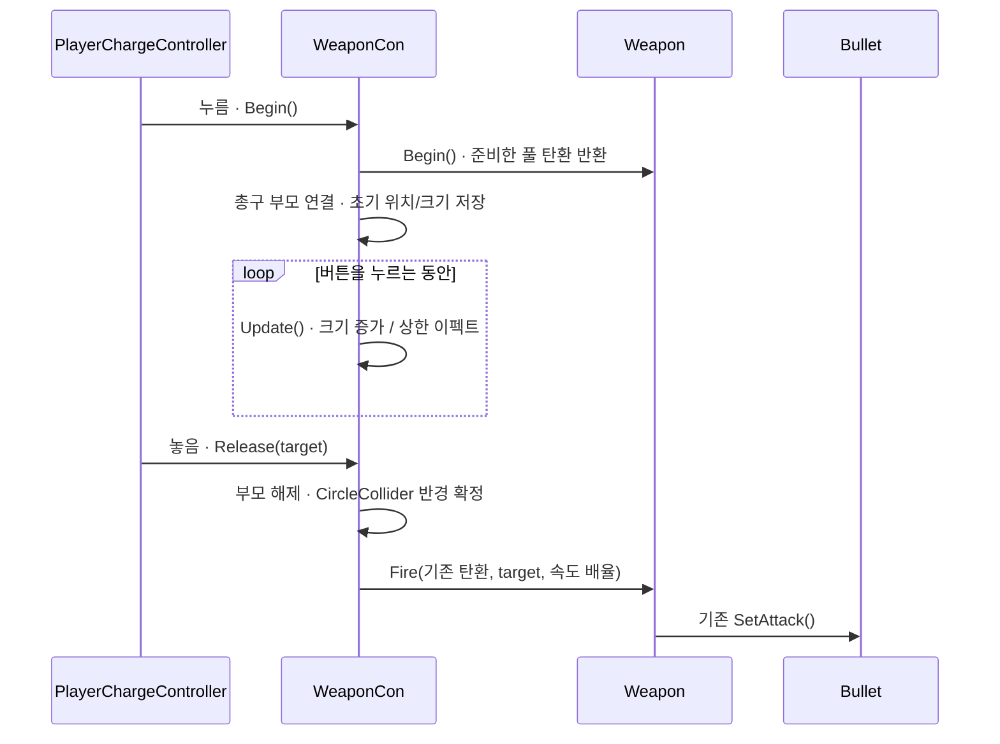

# 플레이어 차지샷 — 컨트롤러가 준비하고, Bullet은 발사만

2026-09-18 사용자 수정안 반영. 구현 전 설계다. 앞서 제안한 `Bullet.BeginCharge`, `Bullet.IsCharging`, `Bullet.LaunchCharge`는 사용하지 않는다.

## 동작과 책임

- 무기에 붙는 `WeaponCon`이 Begin, 차지 시간, Update의 크기 변경, 최대 차지 이펙트, Release/Cancel을 맡는다. 기존 `PlayerChargeController`는 입력 전달만 맡는다.
- `Begin`에서 풀 탄환을 한 번 확보하고 총구 자식으로 배치한다. 부모 연결로 총구를 따라가므로 Update에서 위치를 다시 계산하지 않는다.
- 차지 중에는 크기만 변경한다. CircleCollider는 꺼 두고 반경을 매 프레임 변경하지 않는다.
- Release에서 부모 연결을 해제하고 **반경과 속도를 한 번 계산**한 뒤 `Weapon.Fire(기존 탄환, ...)`로 넘긴다.
- Bullet은 기존 `SetAttack`으로 일반 발사처럼 시작한다. 차지 상태·타이머·차지용 메서드는 추가하지 않는다.
- 최대 차지 후 크기와 발사 속도는 상한을 유지하고 이펙트만 반복한다. 기본 2초, 크기 2배, 속도 2.5배를 사용한다.

## 기존 코드 재사용

- 입력: `InputManager.OnChargeButtonStarted/Released`의 기존 좌클릭 바인딩을 유지한다.
- 발사: `Weapon`의 조준·오차·ApplyActions·OnBulletFired와 `Bullet.SetAttack`을 사용한다. `Weapon.Begin`과 기존 탄환을 받는 `Fire` 오버로드만 추가한다.
- 성능: Update는 컨트롤러 하나의 시간·스케일과 최대 차지 진입만 처리한다. GetComponent와 구독은 Begin 또는 초기화 시점에만 실행한다.
- 확장: 기존 SOAttackInfo/SOPoolData와 Player.m_listWeapon의 카드 강화 경로를 유지한다.

## STEP 1 · Begin — 위치와 초기 상태 확보

`Assets/3D/02_Player/Weapon/WeaponCon.cs` · 신규, 아래는 핵심 메서드 설계다. 참조 필드·입력 배선·풀 복구 코드는 뒤의 연결 항목에 명시한다.

```csharp
public void Begin()
{
    if (m_refBulletObj != null)
        return;

    m_refBulletObj = m_refWeapon.Begin();
    if (m_refBulletObj == null)
        return;

    m_refBulletTr = m_refBulletObj.transform;
    m_refCircleCollider = m_refBulletObj.GetComponent<CircleCollider>();
    m_refPoolObj = m_refBulletObj.GetComponent<PoolObject>();
    m_iGeneration = m_refPoolObj.Generation;
    m_refPoolParent = m_refBulletTr.parent;
    m_vBaseScale = m_refBulletTr.localScale;
    m_fBaseRadius = m_refCircleCollider.Radius;

    m_refBulletTr.SetParent(m_refWeapon.FireTransform, false);
    m_refBulletTr.localPosition = Vector3.zero;
    m_refBulletTr.localRotation = Quaternion.identity;
    m_fChargeTimer = 0f;
    m_bFullCharge = false;
}
```

- **다양성:** 다른 총구 Transform을 지정해 같은 컨트롤러를 사용한다.
- **재사용성:** 기존 풀에서 한 번 인출한다. Bullet에 차지 API를 추가하지 않는다.
- **확장성:** 탄환 외형은 기존 풀 SO를 교체한다. 총구 부모 스케일은 1을 전제로 한다.

## STEP 2 · Update — 크기만 증가

`Assets/3D/02_Player/Weapon/WeaponCon.cs` · 신규

```csharp
private void Update()
{
    if (m_refBulletObj == null)
        return;
    if (m_refPoolObj.Generation != m_iGeneration)
    {
        ClearCharge(); // 풀이 다른 용도로 재사용한 탄환은 건드리지 않는다.
        return;
    }
    if (!m_refBulletObj.activeInHierarchy)
    {
        ClearCharge();
        return;
    }

    m_fChargeTimer = Mathf.Min(m_fChargeTimer + Time.deltaTime, m_fMaxChargeTime);
    float fRatio = m_fChargeTimer / m_fMaxChargeTime;
    float fScale = Mathf.Lerp(1f, m_fMaxVisualScale, fRatio);
    m_refBulletTr.localScale = m_vBaseScale * fScale;

    if (m_bFullCharge || fRatio < 1f)
        return;

    m_bFullCharge = true;
    if (m_refFullChargeEffect != null)
        m_refFullChargeEffect.Play(true);
}
```

- **다양성:** 차지 시간·최대 크기 필드로 조절한다. 두 값은 초기화/OnValidate에서 각각 0.01 이상, 1 이상으로 보정한다.
- **재사용성:** Mathf.Min/Lerp와 Transform 스케일만 사용한다. Collider.SetRadius 호출은 0회다.
- **확장성:** 최대 차지 파티클 참조를 교체한다. 매 프레임 새 파티클이나 배열을 만들지 않는다.

## STEP 3 · Release — 반경과 속도 적용 후 일반 발사

`Assets/3D/02_Player/Weapon/WeaponCon.cs` · 신규

```csharp
public void Release(Vector3 _vTargetPos, Transform _refTarget)
{
    if (m_refBulletObj == null)
        return;
    if (m_refPoolObj.Generation != m_iGeneration)
    {
        ClearCharge();
        return;
    }
    if (!m_refBulletObj.activeInHierarchy)
    {
        ClearCharge();
        return;
    }

    float fRatio = m_fChargeTimer / m_fMaxChargeTime;
    float fScale = Mathf.Lerp(1f, m_fMaxVisualScale, fRatio);
    float fSpeedMultiplier = Mathf.Lerp(1f, m_fMaxSpeedMultiplier, fRatio);

    m_refBulletTr.SetParent(m_refPoolParent, true);
    m_refCircleCollider.SetRadius(m_fBaseRadius * fScale);
    m_refWeapon.Fire(m_refBulletObj, _vTargetPos, _refTarget, fSpeedMultiplier);
    ClearCharge(); // 발사한 탄환은 반납하지 않고 참조와 차지 효과만 정리한다.
}
```

- **다양성:** 중간 차지·최대 차지 모두 같은 발사 경로로 들어간다.
- **재사용성:** Weapon의 기존 발사 처리와 Bullet.SetAttack을 사용한다.
- **확장성:** 속도 배율은 발사별 tShotInfo에 적용한다. 공유 AttackInfo와 다른 탄환을 변경하지 않는다.

## 필요한 연결과 복구

위 세 메서드가 전체 구현은 아니다. 아래 생명주기는 구현과 검증에 포함한다.

1. **Weapon.Begin:** 단발 Bullet/CircleCollider 프리팹을 확인하고 풀에서 인출한다. Bullet 컴포넌트와 CircleCollider를 비활성화하고 풀의 자동반납 예약을 중지한다. 아직 SetAttack은 호출하지 않는다. Bullet 비활성화는 기존 OnDisable을 통해 이동 Job과 OnPush 공격 액션 구독을 해제한다.
2. **Weapon.Fire 오버로드:** 준비한 탄환에 현재 조준 회전과 tShotInfo.Speed를 적용한다. Bullet을 활성화해 기존 구독을 복구하고, SetAttack/ApplyActions/OnBulletFired를 호출한다. CircleCollider는 발사 준비가 끝나면 활성화한다. 일반 Fire도 공통 발사 처리로 연결해 로직 복제를 줄인다.
3. **풀 기능:** PoolObject에 차지라는 이름/상태 없이 `SuspendLifetime()`을 추가한다. Generation만 올려 기존 예약을 무효화한다. `SetAliveTime(0)`은 즉시 반납이므로 사용하지 않는다.
4. **풀 복구:** `WeaponCon`이 준비 탄환의 `PoolObject.OnPush`를 차지 중에만 구독한다. 취소·ActiveCap 강제 회수 등 모든 반납 경로에서 원래 부모·크기·반경을 복원하고 `ClearCharge`에서 구독을 해제한다. 별도 컴포넌트와 Bullet 차지 상태를 추가하지 않는다.
5. **ClearCharge/Cancel:** ClearCharge는 컨트롤러 참조와 효과만 정리한다. Cancel은 현재 Generation을 소유한 준비 탄환만 반납한다. 비활성화·사망·포커스 상실·입력 중단은 발사 대신 Cancel로 연결한다. 비활성화된 Bullet은 OnPush 공격 액션을 구독하지 않으므로 취소로 폭발/분열을 실행하지 않는다.
6. **충돌 그리드:** ColliderManager는 발사 다음 프레임부터 최종 반경을 읽는다. 최초 셀보다 큰 반경에서도 누락되지 않도록 기존 SoA 순회에서 최대 반경을 구해 Job의 조회 셀 범위에 반영한다. 차지 Update에서 그리드를 갱신하지 않는다.



## 확인할 동작

- 누르는 동안 총구의 탄환이 커지고 피해를 주지 않는다.
- 최대 차지 이후 오래 유지해도 사라지거나 자동 발사되지 않는다.
- 놓으면 같은 탄환이 현재 조준 방향으로 발사되고 크기와 판정 반경이 일치한다.
- 풀 반납 후 일반 발사에 크기·속도·비활성 상태가 남지 않는다.
- 취소와 풀 강제 회수 시 다른 탄환을 발사하거나 반납하지 않는다.
- 큰 탄환도 초기 인접 셀 범위 밖에서 충돌을 놓치지 않는다.

기존 자동사격 유지와 별도 차지 무기 추가는 앞선 제안대로다. 수치·효과는 Inspector에서 조절한다. 완료 후 기존 Slack 대상에 검증 결과와 PR 링크를 보낸다.

## Result

- `PlayerChargeController`가 있는 플레이어만 차지 입력을 구독하도록 `Player`의 암묵적 의존을 제거하고, `WeaponCon`을 필수 직렬화 참조로 명시했다.
- 준비 탄환 반납 시 부모·스케일·반경을 `PoolObject.OnPush`에서 복원해 취소와 강제 회수 뒤 풀 상태가 남지 않게 했다.
- `LobyScene`의 `MainPlayer`와 `BaseWeapon_0`에 컴포넌트와 참조를 저장했다.
- Unity 스크립트 컴파일과 로비 Play 진입에서 오류 0건을 확인했다. 관련 자동 테스트는 저장소에 없어 실행하지 않았다.
- 독립 Unity 리뷰의 치명적 2건을 반영했고 재검증에서 치명적·성능 문제 0건을 확인했다.
- 수동 확인: 실제 전투에서 차지 시작→취소→재차지, 최대 차지 발사, ActiveCap 강제 회수 뒤 탄환 크기·부모 상태를 확인한다.
