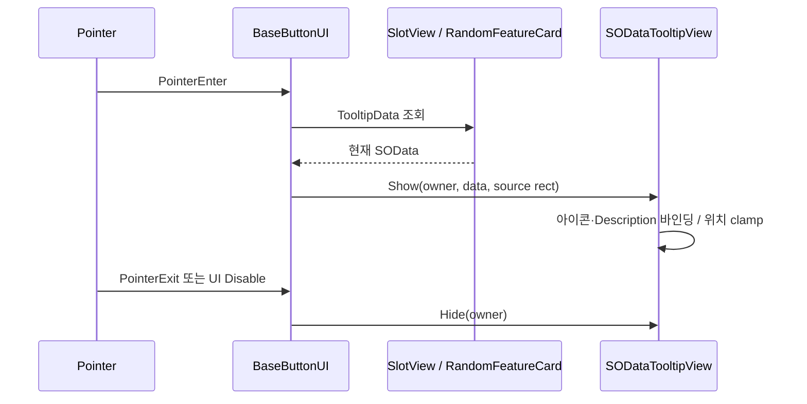

# SOData 호버 설명창 — SlotView·랜덤 카드·Joker 성공 후보 공용

2026-09-20 사용자 승인. 야간 autopilot 예약 작업이다. 구현 전에 추가 질문하지 않고 이 문서의 결정을 따른다.

## Overview

마우스가 `SOData`를 가진 UI 위에 올라가면 아이콘과 `SOData.Description`을 별도 설명창으로 보여주고, 벗어나면 닫는다. 하나의 공용 표시 경로를 사용해 다음 세 영역에 같은 동작을 적용한다.

- `Container`가 생성·재사용하는 모든 `SlotView`
- 레벨업 때 무작위 후보를 보여주는 `RandomFeatureCard`
- Joker 성공 뒤 후보/선택/보유 컨테이너에 표시되는 `SlotView`

초기 Joker 카드인 `JokerFeatureCard`는 `RandomFeatureCard`를 상속하므로 같은 설명창 동작을 자동으로 사용한다. 클릭 선택과 기존 카드 회전 연출은 변경하지 않는다.

## User Flow

1. 사용자가 데이터가 들어 있는 슬롯 또는 공개가 끝난 랜덤 카드 위에 마우스를 올린다.
2. 해당 UI 옆에 공용 설명창이 열리고 `SOData.Icon`과 `SOData.Description`을 표시한다.
3. 화면 경계에 가까우면 설명창 위치를 반대편 또는 화면 안쪽으로 보정한다.
4. 마우스가 UI를 벗어나거나, UI가 비활성화되거나, 슬롯 데이터가 비어 있는 값으로 재바인딩되면 설명창을 닫는다.
5. 빈 슬롯 위에서는 설명창을 열지 않는다.

## Existing Code to Reuse

- `Assets/3D/02_Player/Feature/SOData.cs`: 모든 표시 대상이 이미 공통 `Icon`과 `Description`을 제공한다. 개별 SO 타입에는 새 설명 필드를 추가하지 않는다.
- `Assets/3D/11_UI/Script/BaseButtonUI.cs`: `OnPointerEnter`/`OnPointerExit`가 이미 모든 대상 UI의 포인터 이벤트를 받는다.
- `Assets/3D/11_UI/Script/SlotView.cs`: `BindData()`가 현재 슬롯의 `m_SOTargetSO`를 교체한다. `Container.BindData()`가 일반 컨테이너와 Joker 컨테이너 모두 이 경로를 사용한다.
- `Assets/3D/11_UI/Script/RandomFeatureCard.cs`: `Setup()`이 무작위 후보의 `m_SOData`를 설정하며 `JokerFeatureCard`도 이 클래스를 상속한다.
- `Assets/3D/11_UI/Script/DataDescUI.cs`: 아이콘과 TMP 설명 텍스트 바인딩은 이 뷰의 `Show(SOData)` 동작을 재사용하거나, 새 툴팁 뷰 내부에서 동일 책임이 중복되지 않도록 조합한다.
- 기존 로비의 `PopUpCanvas/ItemShopMain/ItemShop/ItemDesc`는 고정된 상점 선택 설명 UI다. 상점 동작을 깨지 않으며, 새 호버 툴팁의 시각 스타일 참고 대상으로만 사용한다.

## Functional Requirements

1. `SOData == null` 또는 설명창 인스턴스가 없는 경우 예외 없이 아무것도 표시하지 않는다.
2. 한 번에 설명창 하나만 활성화한다. 새 대상에 진입하면 그 대상의 데이터와 위치로 즉시 교체한다.
3. 이전 대상의 늦은 `PointerExit`가 현재 대상의 설명창을 닫지 않도록 표시 소유자를 추적한다.
4. 툴팁의 이미지와 TMP 텍스트는 `raycastTarget`을 꺼서 원래 슬롯의 hover/click을 방해하지 않는다.
5. 설명창은 `Update`, `LateUpdate`, `FixedUpdate`를 사용하지 않는다. 표시, 내용 갱신, 위치 계산은 포인터 진입과 데이터 재바인딩 시점에만 수행한다.
6. 위치 계산에 필요한 코너 버퍼는 재사용해 hover마다 배열을 생성하지 않는다. TMP 텍스트 변경은 hover 시점에만 허용한다.
7. `SlotView.BindData()`가 현재 hover 중인 슬롯의 데이터를 바꾸면 새 데이터로 갱신하거나, null이면 즉시 닫는다.
8. `RandomFeatureCard.Setup()`이 데이터를 바꾸면 현재 hover 상태와 표시 내용을 일치시킨다. 카드가 닫히거나 비활성화되면 설명창도 닫는다.
9. 카드 공개 연출 중에는 뒷면이 클릭 불가인 기존 규칙을 유지한다. 설명창은 실제 후보 정보가 노출되는 시점 이후에만 표시하는 쪽을 우선한다. 구현이 기존 raycast 구조상 이를 안전하게 구분하기 어렵다면 카드 공개 완료 플래그를 추가하되 Update 외 추가 폴링은 만들지 않는다.
10. 마우스 입력을 우선 범위로 한다. Android 터치용 길게 누르기 동작은 이번 PRD 범위에 포함하지 않는다.

## Technical Architecture

### 공용 표시창

`Assets/3D/11_UI/Script/SODataTooltipView.cs`를 새로 만든다.

- 씬 로컬 단일 인스턴스로 동작하며 `DontDestroyOnLoad`를 사용하지 않는다.
- 직렬화 참조: 표시 패널 `RectTransform`, 아이콘 `Image`, 설명 `TextMeshProUGUI`, 기준 Canvas/RectTransform, 화면 가장자리 여백과 대상 UI로부터의 오프셋.
- `Show(BaseButtonUI owner, SOData data, RectTransform source)`와 `Hide(BaseButtonUI owner)`에 준하는 API를 제공한다. 실제 이름은 프로젝트 컨벤션에 맞춰도 되지만 소유자 가드는 유지한다.
- 표시 직전에 내용을 바인딩하고 레이아웃을 한 번 갱신한 뒤, 대상 슬롯 옆에 배치하고 기준 Canvas 영역 안으로 clamp한다.
- `OnDestroy`에서 자신이 현재 인스턴스일 때만 정적 참조를 해제한다.

### Hover 데이터 제공

`BaseButtonUI`에 기본값이 null인 보호된 가상 tooltip-data 접근점과 현재 pointer-inside 상태를 둔다.

- 기존 `OnPointerEnter`/`OnPointerExit`의 UnityEvent와 R3 Subject 발행은 순서와 동작을 유지한다.
- enter 뒤 유효 데이터가 있으면 공용 뷰에 표시한다.
- exit와 disable에서 자신의 표시를 닫는다.
- 파생 클래스가 bind/setup 뒤 호출할 수 있는 보호된 refresh 메서드를 제공한다.

`SlotView`는 접근점을 `m_SOTargetSO`로 재정의하고 `BindData()` 끝에서 refresh한다. `RandomFeatureCard`는 접근점을 `m_SOData`로 재정의하고 `Setup()` 및 공개 완료 시점에 상태를 맞춘다. 두 클래스에 별도 tooltip 참조를 직렬화하지 않는다.

## UI Asset and Scene Wiring

- 재사용 프리팹: `Assets/3D/11_UI/Item/SODataTooltip.prefab`
- 기존 Sci-Fi UI 배경 스타일을 사용하되, 작은 아이콘과 여러 줄 TMP 설명이 들어가는 간결한 패널로 구성한다.
- 글자는 `TextMeshProUGUI`만 사용한다. 설명 텍스트와 장식용 그래픽의 raycast target은 끈다.
- 런타임 진입점인 `Assets/00_Scene/Loby/LobyScene.unity`의 최상위 UI Canvas 계층에 한 개 배치한다.
- 실제 Addressable 전투 씬인 `Assets/00_Scene/3D/MainScene/SceneData/BattleScene.unity`의 카드/컨테이너와 함께 보이는 UI Canvas 계층에 한 개 배치한다.
- `BattleScene_2`, 구형 `MainScene`, 2D 씬은 이번 PRD에서 수정하지 않는다. 공용 코드와 프리팹은 필요 시 나중에 같은 방식으로 배치할 수 있게 유지한다.
- 씬과 프리팹은 YAML을 직접 편집하지 않고 Unity MCP로 생성·배선·저장한다. 작업 시작 시 실제 씬 인스턴스의 Canvas, `CardCreator`, `JokerCardManager` 컨테이너를 MCP로 다시 확인한다.

## Tests and Verification

`Assets/Tests/Editor/SODataTooltipViewTests.cs` 또는 프로젝트 테스트 구조에 맞는 동등한 EditMode 테스트를 추가한다. 테스트 전용 `SOData`/hover source는 `#if UNITY_INCLUDE_TESTS` 경계 안에 둔다.

- 유효한 SOData를 표시하면 패널이 활성화되고 아이콘과 Description이 반영된다.
- null 데이터는 열리지 않는다.
- 현재 소유자가 아닌 UI의 Hide 요청은 현재 설명창을 닫지 않는다.
- 현재 소유자의 exit/disable 요청은 설명창을 닫는다.
- 데이터가 null로 재바인딩되면 닫힌다.

Unity 검증 순서:

1. 스크립트 작성 후 `refresh_unity`와 error console 0건 확인.
2. EditMode 전체 테스트 실행 및 결과 수집.
3. `LobyScene`에서 아이템/스탯 컨테이너의 채워진 슬롯과 빈 슬롯을 확인.
4. `BattleScene`에서 일반 랜덤 기능 카드, Joker 카드, Joker 성공 후보/선택 슬롯을 확인.
5. 화면 네 모서리에 가까운 대상에서도 패널이 화면 밖으로 잘리지 않고 클릭/선택을 방해하지 않는지 확인.
6. 변경된 C# 파일을 독립 `unity-reviewer`에게 넘겨 직렬화 안전성, 포인터 생명주기, 할당 여부를 검토한다.

## Acceptance Checklist

- [ ] 데이터가 있는 일반 `SlotView` hover 시 아이콘과 설명이 표시된다.
- [ ] 빈 `SlotView` hover 시 아무 창도 표시되지 않는다.
- [ ] 랜덤 기능 선택 카드 hover 시 해당 `SOFeature.Description`이 표시된다.
- [ ] Joker 카드와 Joker 성공 후보/선택 슬롯에도 같은 동작이 적용된다.
- [ ] exit, disable, null rebind에서 설명창이 남지 않는다.
- [ ] 설명창이 포인터 raycast와 기존 click/drag를 방해하지 않는다.
- [ ] 화면 가장자리에서 설명창이 Canvas 밖으로 잘리지 않는다.
- [ ] 새 Update/FixedUpdate와 hover당 배열 할당이 없다.
- [ ] Unity 컴파일 오류 0건, 관련 신규 테스트와 기존 EditMode 테스트가 통과한다.

## Out of Scope

- 모든 SO에 별도 표시 이름·희귀도·상세 스탯 필드를 추가하는 작업
- Android 길게 누르기/터치 전용 툴팁 UX
- 기존 상점 `DataDescUI`의 선택 방식 변경
- `BattleScene_2`, 구형 `MainScene`, 2D 씬에 프리팹을 추가하는 작업
- Joker 확률, 후보 수, 카드 선택 규칙 변경

