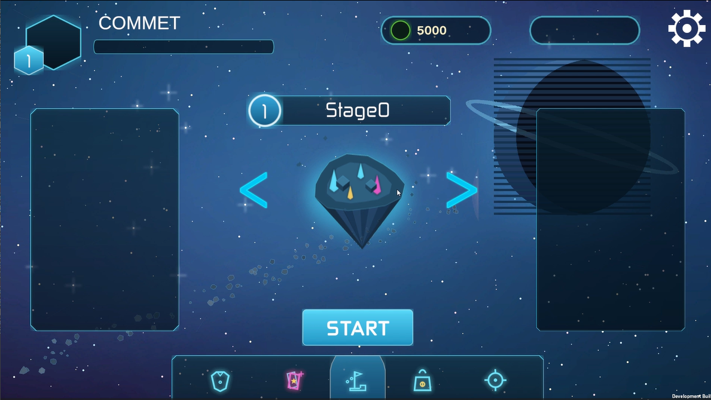
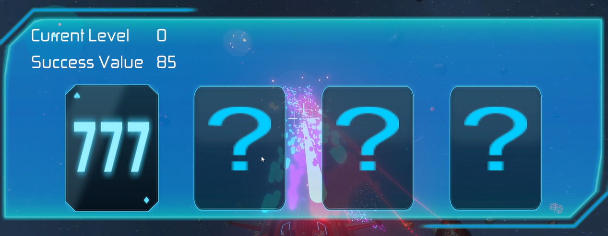
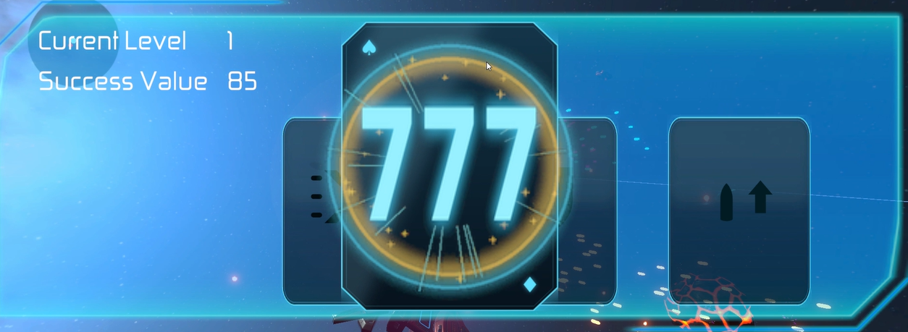
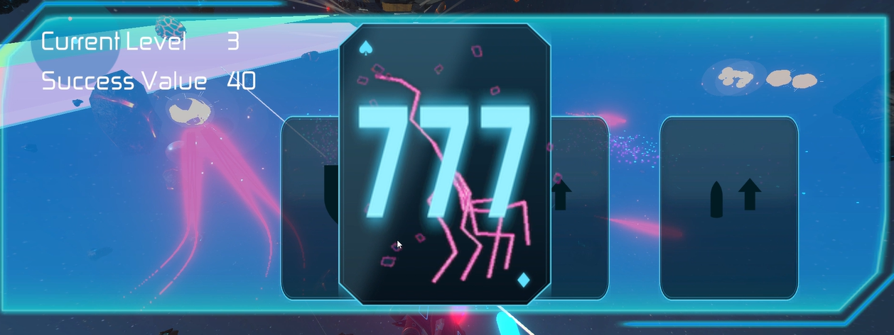
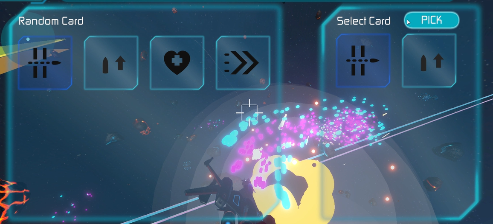
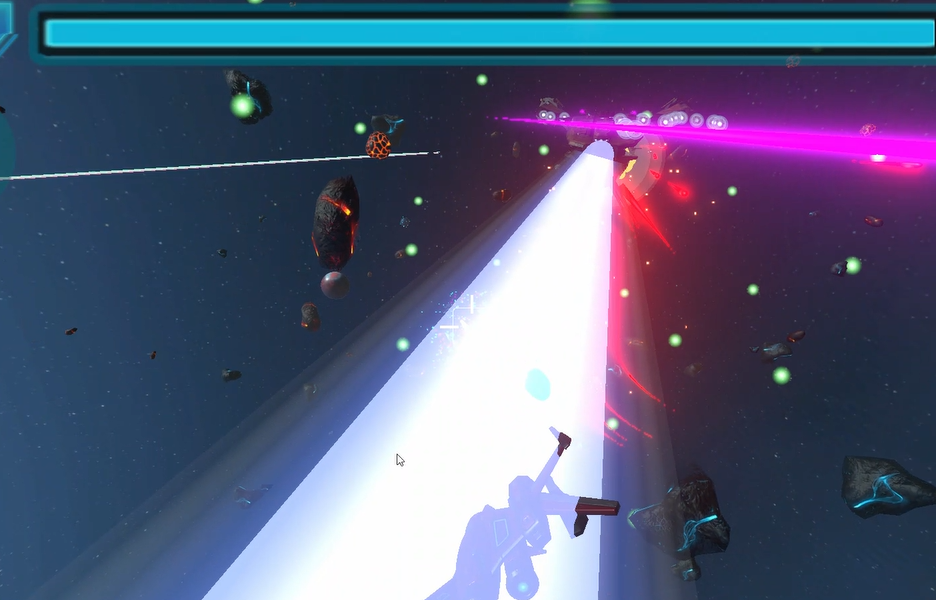

# 오비탈 (Orbital)

Unity(URP)로 제작 중인 **3D 슈팅 게임**입니다.
레벨업 3택 위에 등급형 조커 카드 도박이라는 하이 리스크 성장 계층을 더해, "한 번 더 걸어볼까 여기서 멈출까"를 매 레벨업마다 반복시키는 것이 이 게임의 정체성입니다.

> 데모 영상: (업로드 예정)

## 게임 소개

| 항목 | 내용 |
|---|---|
| 장르 | 3D 슈팅 · 로그라이트 |
| 개발 환경 | Unity 2022.3.62f2, URP |
| 플랫폼 | Windows (주 타겟) 
| 레퍼런스 | 뱀파이어 서바이버즈, 궁수의 전설 |
| 핵심 루프 | 로비 → 던전 입장 → 전투(스테이지 순차 진행) → 레벨업 3택 / 조커 도박 → 보스 처치 → 클리어 or 사망 → 다음 런 |

몰려오는 몬스터를 자동·반자동 사격으로 정리하며 던전을 반복 클리어하는 슈팅에, 두 겹의 랜덤 성장 시스템을 얹었습니다.

## 조작법

| 입력 | 동작 |
|---|---|
| `W` `A` `S` `D` | 이동 |
| 마우스 이동 | 조준 , 회전 |
| `Space` | 플레이어 롤링 (좌 우 빠른 이동) |

## 핵심 시스템 — 이중 랜덤 구조

- **레벨업 3택** — 몬스터를 잡아 경험치를 채우면 확정적으로 카드 3장 중 1장을 고르는 안전한 성장. 체력/공격력/방어력/이동속도/탄속 강화부터 관통, 무기·드론 추가까지 구현되어 있습니다.
- **조커 카드 도박** — 플레이어가 원할 때 도전하는 확률형 잭팟. 연속 성공할수록 후보 등급(일반→희귀→에픽)과 선택 폭이 함께 오르지만, 실패하면 보류 중이던 카드와 이미 확정된 카드까지 잃습니다.

자세한 설계(등급, 확률 곡선, 엣지 케이스 등)는 [`.claude/docs/game-design.md`](.claude/docs/game-design.md)에 정리되어 있습니다.

## 던전 & 몬스터

- **던전 진행** — `DungeonManager`가 스테이지(`SOStage`)를 순서대로 진행하며, 각 스테이지는 시간표 기반 스폰 테이블을 갖고 마지막 스테이지에서만 보스가 등장합니다.
- **몬스터 AI** — Behavior Tree + ScriptableObject Action + Blackboard 구조로 동작하며, 이동/추적/조준/발사/대기 등 25종 이상의 BT 노드가 구현되어 있습니다.

## 핵심 기술

- **Burst Job 기반 탄막 이동** — `BulletMoveManager`/`MissileMoveManager`가 `TransformAccessArray` + Burst Job으로 대량의 탄을 처리해, 화면을 채우는 탄막에서도 프레임을 유지합니다.
- 탄막이 화면을 채워도 60FPS”라는 조건 하나를 지키기 위해 Unity PhysX를 걷어내고 Job을 활용한 병렬, 공간분할 충돌 판정을 직접 만들었습니다.`ColliderManager`/`BoxColliderGrid`
- **Behavior Tree + Blackboard 몬스터 AI** — SO로 작성된 Action 노드를 인스펙터에서 조립/교체하고, Blackboard로 몬스터 간 상태·타겟 정보를 공유합니다.
- **오브젝트 풀링** — 자주 생성/삭제되는 Bullet, FX, Enemy는 전용 Object Pool을 거쳐 Instantiate/Destroy 오버헤드를 제거합니다.
- **데이터 기반 밸런싱** — 레벨업 카드, 조커 카드 확률 곡선, 장비 스탯 등이 전부 ScriptableObject 데이터로 분리되어 있어 코드 수정 없이 밸런스 조정이 가능합니다.
- **UniTask 비동기**, **C# 이벤트 기반 시스템 간 통신**

## 프로젝트 구조

```
Assets/
├─ 3D/
│  ├─ 02_Player/     플레이어 이동, 무기, 장비
│  ├─ 03_Monster/    몬스터 AI(Behavior Tree), 스폰
│  ├─ 04_Map/        던전/맵 구성
│  ├─ 05_Manager/    DungeonManager, BattleManager, FeatureManager 등
│  ├─ 06_Input/      New Input System 액션 에셋
│  ├─ 07_Render/     URP 렌더 파이프라인 세팅
│  └─ 08_Effect/     이펙트, VFX
├─ 2D/               2D UI 리소스
├─ 00_Scene/         로비/전투 씬
└─ Plugins/          UniTask, DOTween 등 서드파티
```

## 스크린샷

### 로비



### 레벨업 3택



### 조커 카드 — 성공



### 조커 카드 — 실패



### 조커 카드 - 보상



### 보스전




